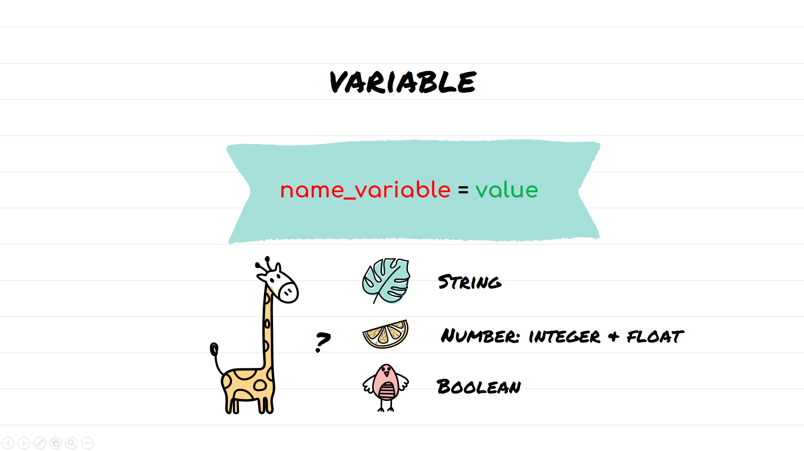

# Python4Everyone
Python Basics for Machine Learning - Data Science - Data Analyst

## Python

- Python là một ngôn ngữ lập trình cấp cao và dễ tiếp cận hơn đối với những người mới bắt đầu học ngôn ngữ lập trình.
- Với xu hướng phát triển của Trí tuệ nhân tạo, Robotics thì việc Python là ngôn ngữ phổ biến nhất hiện nay là việc bình thường.
- Với Python bạn có thể làm được nhiều điều khác nhau:
  +  Học máy (machine learning) - Trí tuệ nhân tạo (AI)
  +  Phân tích dữ liệu (data analysis)
  +  Thiết kế Web 
  +  Làm Game
  +  Phát triển ứng dụng điện thoại

Python có cú pháp rất đơn giản vì đã được hỗ trợ bỡi rất nhiều thư viện và cấu hình bằng C++ phía bên dưới. Mặc dù đôi lúc sự đơn giản này có thể gây ra một số phiền phức trong việc quản lý chương trình. Tuy nhiên Python làm cho việc lập trình trở đơn giản hơn, đặc biệt là các tác vụ nhập xuất (input và output), cho phép bạn tập trung vào những giải pháp chứ không phải cú pháp của ngôn ngữ lập trình. Một cách so sánh trừu tượng, Python tạo điều kiện cho bạn "giao tiếp ngôn ngữ", hơn là việc phải "học ngôn ngữ" một cách truyền thống.

```
Đến với nội dung Python, mình muốn gửi đến các bạn những kiến thức cơ bản nhất để có thể bắt đầu với ML hay AI ở các bài sau.
```
Ok. Giới thiệu sơ qua để chúng ta biết đang làm gì ở đây, bây giờ thì bắt đầu tìm hiểu những kiến thức cơ bản của Python thôi nào.

Đến với [Python4Everyone](https://kysukysu.github.io/Python4Everyone/) chúng ta sẽ cùng đi qua 10 bài học, với từng bài học đều có ví dụ và hình minh họa cho từng kiến thức.
_____________
### Bài 1: [01_variables](/Python/01_variables.ipynb)

Kiến thức đầu tiên ta cần nắm là `biến` (variable): Biến là vùng chứa để lưu giữ dữ liệu và chúng được xác định bằng tên và giá trị.
[](/Python/01_variables.ipynb)

### Bài 2-3-4: [List](/Python/02_list.ipynb)-[Tuple](/Python/03_tuples.ipynb)-[Dictionaries](/Python/04_dictionaries.ipynb)
- List-Tuple-Dictionaries là 3 kiểu dữ liệu cơ bản trong Python mà khi làm việc ta có thể gặp chúng thường xuyên. Với mỗi kiểu dữ liệu đều có chức năng và sức mạnh khác nhau.
- Các đối tượng List và Tuple là các chuỗi, các chỉ mục có thứ tự.
- Từ điển là một hash table của các cặp key-value, là bộ sưu tập không có thứ tự.
```
>>> L = [12, "Ravi", "B.Com FY", 78.50] #list
>>> T = (12, "Ravi", "B.Com FY", 78.50) #tuple
>>> D = {"Rollno":12, "class":"B.com FY", "precentage":78.50} #dictionary
```
Vào xem chi tiết bài [List](/Python/02_list.ipynb)

[](/Python/02_list.ipynb)

Vào xem chi tiết bài [Tuple](/Python/03_tuples.ipynb)

[](/Python/03_tuples.ipynb)

Vào xem chi tiết bài [Dictionaries](/Python/04_dictionaries.ipynb)

[](/Python/04_dictionaries.ipynb)

### Bài 5: [Conditional Statements - If](/Python/05_conditional_Statements.ipynb)
Trong Python, câu lệnh `if` được sử dụng để đưa ra quyết định có điều kiện. Các điều kiện được xác định bởi các từ `if`, `else` và `elif` (viết tắt của `else if`). Chúng ta có thể có nhiều câu lệnh `elif`. 

[](/Python/05_conditional_Statements.ipynb)

### Bài 6: [Loops](/Python/06_loops.ipynb)
- For loops:
  + Vòng lặp for có thể lặp qua tập hợp các giá trị (list, bộ giá trị, dict, v.v.)
  + Đoạn code trong for phải được thụt lề đồng bộ với nhau.
[](/Python/06_loops.ipynb)
- While loops:
  + Vòng lặp while có thể thực hiện lặp đi lặp lại miễn là điều kiện là True.
  + Chúng ta cũng có thể sử dụng lệnh continue và lệnh break trong vòng lặp while.
[](/Python/06_loops.ipynb)

### Bài 7: [Functions](/Python/07_functions.ipynb)
- Hàm (function) là một cách để mô-đun hóa các đoạn mã có thể tái sử dụng. 
- Chúng được định nghĩa bởi từ khóa `def`, viết tắt của `definition`.
- Hàm có các thành phần sau.
[](/Python/07_functions.ipynb)

### Bài 8: [Classes](/Python/08_classes.ipynb)
- Python là một ngôn ngữ lập trình **hướng đối tượng**.
- Hầu hết mọi thứ trong Python đều là một `đối tượng`, với các `thuộc tính` và `phương thức` của nó.
- Một `class` giống như một phương thức `khởi tạo đối tượng`, hoặc một `bản thiết kế` để tạo các đối tượng.

### Bài 9-10:  [Decorators](/Python/09_decorators1.ipynb) - [Callbacks](/Python/10_decorators2.ipynb)
- **Decorator**: là một hàm nhận tham số đầu vào là một hàm khác và mở rộng tính năng cho hàm đó mà không thay đổi nội dung của chúng.
- **Callbacks**: là việc xử lý điều kiện/tình huống bên trong hàm.
[](/Python/09_decorators1.ipynb) 

